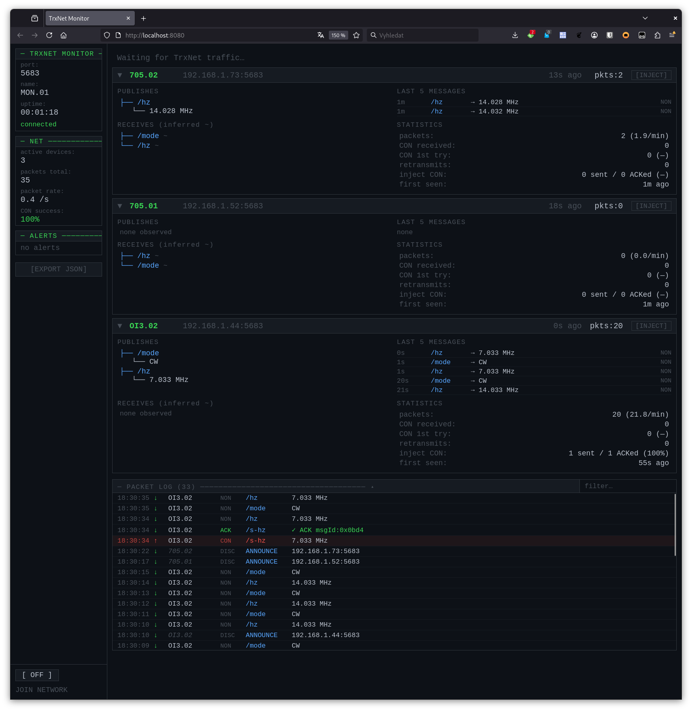

# TrxNet Monitor

A passive UDP sniffer and real-time web dashboard for TrxNet networks.
Runs on a developer laptop; opens automatically in the browser.



---

## Requirements

- Python 3.8+
- `websockets` ≥ 12: `pip install 'websockets>=12'`

---

## Usage

```
python monitor.py [--port PORT] [--http-port PORT] [--name NAME] [--max-pending N] [--max-peers N]
```

| Option | Default | Description |
|--------|---------|-------------|
| `--port` | `5683` | UDP port to listen on (must match TrxNet devices) |
| `--http-port` | `8080` | HTTP/WebSocket port for the browser UI |
| `--name` | `MON.01` | Device name used when JOIN NETWORK is active |
| `--max-pending` | `2` | `TRXNET_MAX_PENDING` value in firmware (used for overflow detection) |
| `--max-peers` | `8` | Smallest node's `TRXNET_MAX_PEERS` — peer-table-full alert threshold. Since library v1.04 this is per-board: `8` = ATmega2560, `24` = ESP32. Set it to the value of the most RAM-constrained device on your network (for an all-ESP32 network use `24`). |

The browser opens automatically at `http://localhost:8080`.

---

## Files

```
monitor/
  monitor.py    backend — UDP sniffer + WebSocket server
  monitor.html  frontend — served by the backend, no build step
```

---

## How it works

### Passive mode (JOIN NETWORK OFF)

The monitor binds a UDP socket to `0.0.0.0:<port>` and listens for:

- **Discovery broadcasts** (`0xAA 0x01 …` to `255.255.255.255`) — PROBE and ANNOUNCE packets from all TrxNet devices. Device names, IPs, and ports are extracted immediately.
- **CoAP POST packets addressed to the monitor** — none arrive in passive mode because devices only publish to registered peers.

**What you see in passive mode:** discovery events, device presence, alerts based on announcement timing. No CoAP data.

### Active mode (JOIN NETWORK ON)

The monitor sends a PROBE broadcast and periodic ANNOUNCE every 30 s, joining the network as a peer named `--name`. All TrxNet devices that hear the PROBE add the monitor to their peer table and begin publishing CoAP packets to it.

**What you see in active mode:** all published topics and payloads, retransmit counts, CON/ACK statistics for the monitor link.

> **Peer table limit:** each firmware device holds `TRXNET_MAX_PEERS` peers — since library v1.04 this is per-board (`8` on ATmega2560, `24` on ESP32; a full table can be protected with `setPriorityPrefixes()`). The monitor itself tracks every device it hears, but when JOIN NETWORK is active it occupies one peer slot in each device's table, so on a network at the smallest node's limit, joining can push that node over. The **peer-table-full** alert fires when the number of observed devices reaches `--max-peers` (default `8`); set that flag to your most RAM-constrained device's value.

---

## UI layout

### Left panel

| Field | Description |
|-------|-------------|
| port / name / uptime | Monitor configuration and runtime |
| active devices | Devices seen via discovery or CoAP |
| packets total | All UDP packets received since start |
| packet rate | 10-second sliding window average |
| CON success | ACK rate for CON messages sent via INJECT |

**ALERTS** — listed newest-first. Stateful alerts (e.g. peer timeout risk) clear automatically when the condition resolves. Event alerts (e.g. CON lost) must be dismissed manually with `[x]`.

**JOIN NETWORK** — toggle to join or leave the network as a peer. The name field uses `--name` from the command line.

**[EXPORT JSON]** — downloads `trxnet-monitor-YYYYMMDD-HHMMSS.json` with the full current state (devices, packet ring buffer, statistics, alerts).

### Right panel

One row per discovered device. Click a row to expand its detail card.

**Collapsed row:**
```
▶ 705.01   192.168.1.42:5683   8s ago   pkts:142   [INJECT]
```

**Expanded card:**

- **Publishes** — topics for which a CoAP POST from this device was observed, with the last decoded value.
- **Receives ~** — topics inferred to be received by this device (observed publishes from other peers), marked `~` because subscriptions are not observable on the network.
- **Statistics** — packet count, CON first-try rate, retransmit count, INJECT CON success, first seen time.
- **Last N messages** — ring buffer of the 20 most recent CoAP POSTs from this device.

---

## Inject

Press `[INJECT]` on any device row to open the inject form.

| Field | Description |
|-------|-------------|
| target | Device to send to (IP and port from discovery) |
| topic | Path to publish on; autocomplete from observed traffic |
| type | Payload encoding: `uint32` / `uint16` / `uint8` / `string` / `raw hex` |
| value | Value to encode and send |
| transfer | **NON** — fire-and-forget. **CON** — confirmed, up to 3 retries every 2 s |

**Passive mode (JOIN NETWORK OFF):** the packet is sent as raw UDP directly to the target IP:port. The device will invoke callbacks for subscribed topics, but the monitor is not in its peer table; CON ACKs are not expected.

**Active mode (JOIN NETWORK ON):** the monitor is a registered peer; CON ACKs are expected and tracked. A `CON lost` alert fires if no ACK arrives after 3 retries.

---

## Payload decoding

| Topic | Type | Example |
|-------|------|---------|
| `/freq` | `uint32 LE` Hz | `14.250 MHz` |
| `/mode` | `uint8` CI-V code | `USB` |
| `/flags` | `uint16 LE` CI-V bitmask | `PTT \| SPLIT` |
| `/cw` | ASCII string | `"CQ CQ DE OK1HRA"` |
| `/azimuth`, `/elevation`, `/s-azimuth`, `/s-elevation` | `uint16 LE` degrees | `180°` |
| other | raw bytes | `0x 03 A1 FF` |

---

## Version check

On startup the monitor fetches `library.properties` from the `main` branch on GitHub
and compares the `version` field to the version of the running code.

If a newer version is available, a **red banner** appears at the top of the left panel
showing the new version, the currently running version, and a link to the repository.

The check runs once at startup. If GitHub is unreachable the check is silently ignored —
no warning is shown and the monitor continues normally.

---

## Alerts reference

| Alert | Trigger | Clears |
|-------|---------|--------|
| CON queue overflow [inferred] | Simultaneous active retransmit chains from a device > `--max-pending` | Automatically when chains drop |
| Peer table full | ≥ 6 devices observed | Automatically when count drops |
| Peer timeout risk | Device sent no ANNOUNCE for > 60 s | Automatically on next ANNOUNCE |
| No discovery traffic | No PROBE or ANNOUNCE for > 120 s | Automatically on next discovery |
| CON lost | INJECT CON unACKed after 3 retries | Manual dismiss |
| Payload truncated | CoAP payload > 64 bytes | Manual dismiss |

---

## Protocol notes

- Discovery packets begin with `0xAA 0x01` — safe to distinguish from CoAP (version bits `10` are invalid in CoAP).
- CoAP packets follow RFC 7252 with TKL=0 and a single Uri-Path option chain.
- `subscribe()` in TrxNet is a local callback — no subscribe packet is sent on the network. The **Receives ~** column is the closest observable equivalent.
- `TRXNET_MAX_PENDING` (default 2) is the sender-side CON queue. CON queue overflow detection in the monitor is an inference from simultaneous retransmit activity and may produce false positives at high traffic rates.
