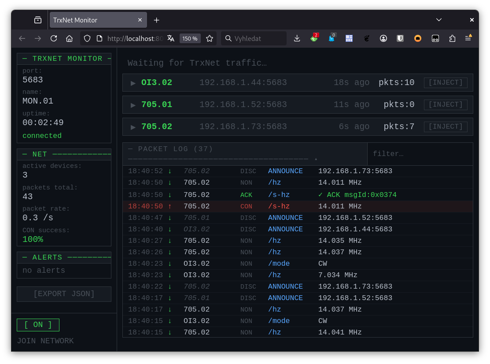

# TrxNet

P2P telemetry and messaging for ham radio devices over a local network.

- Device discovery via **UDP broadcast** (no mDNS, no broker, no router required)
- Transport via a **minimal CoAP** implementation built into the library
- Supports **ESP32** (WiFiUDP) and **ATMEGA2560 + Ethernet shield** (EthernetUDP)
- No dynamic memory allocation — safe for long-running embedded devices

Currently used in these devices
- [IP-rotator](https://github.com/ok1hra/IP-rotator)
- [ESP32 QRPlog for IC-705](https://github.com/ok1hra/IC-705_Interface)
- [TrxNet Monitor](https://github.com/ok1hra/TrxNet/blob/main/MONITOR.md)
- [IP Antenna Matrix Controller up to 16x4](https://github.com/ok1hra/AntHub-NET)
- [Open Interface III](https://github.com/ok1hra/oi3)
- [ESP32 DIN rail module (Config: TrxNetSwitch)](https://github.com/ok1hra/eth-din-dev-kit)
- NodeRed

---

## Installation

Copy the `TrxNet/` folder into your Arduino libraries directory:

```
~/Arduino/libraries/TrxNet/
```

Arduino IDE will find it automatically on next restart.

---

## Quick start

```cpp
// Type and ID are separate so each can come from EEPROM / config menu.
// NET_ID 0x00 is reserved as "disabled" sentinel — do not use as a real device ID.
char deviceType[16] = "705";        // device type prefix, e.g. "OI3", "705", "ROT"
char deviceId[8]    = "01";
char deviceName[TRXNET_MAX_DEVICE_NAME];  // assembled in setup()

WiFiUDP udp;                        // or EthernetUDP udp;
TrxNet  net(udp);                   // name not known at global init time

void onFreq(const char* from, const uint8_t* data, size_t len) {
    uint32_t freq;
    memcpy(&freq, data, sizeof(freq));
}

void setup() {
    // ... connect WiFi or Ethernet first ...
    snprintf(deviceName, sizeof(deviceName), "%s.%s", deviceType, deviceId);
    net.begin(deviceName);
    net.subscribe("/freq", onFreq);
}

void loop() {
    net.loop();                     // must be called every iteration

    uint32_t freq = 14250000UL;
    net.publish("/freq", (uint8_t*)&freq, sizeof(freq));
}
```

---

## API reference

### Constructor

```cpp
TrxNet net(UDP& udp, uint16_t port = 5683);
```

| Parameter | Description |
|-----------|-------------|
| `udp`     | `WiFiUDP` or `EthernetUDP` instance. Must outlive `TrxNet`. |
| `port`    | UDP port used for both discovery and CoAP. All devices in the network must use the same port. Default: 5683. |

The device name is **not** passed to the constructor — it may not be known yet at global init time (e.g. when it is loaded from EEPROM or set via a config menu). Pass it to `begin()` instead.

---

### `void begin(const char* name)`

Sets the device name, starts the UDP socket, and broadcasts a discovery probe.  
Call once, **after** WiFi/Ethernet is connected and the device name is known.

| Parameter | Description |
|-----------|-------------|
| `name`    | Device identity string assembled at runtime, e.g. `"705.01"` or `"OI3.ff"`. Max 31 chars. Two devices with the same name are treated as one. Typically built as `snprintf(buf, sizeof(buf), "%s.%02x", deviceType, netId)`. **NET_ID `0x00` is reserved as "disabled" — do not call `begin()` when NET_ID is 0.** |

---

### `void loop()`

Processes all incoming packets, sends periodic keepalive, and retransmits unACKed CON messages.

**Must be called every iteration of Arduino `loop()` without blocking delays.**  
Blocking for more than ~2 seconds risks missing discovery probes and CON retransmit windows.

---

### `void subscribe(const char* path, TrxNetCallback cb)`

Registers a callback for incoming messages on `path`.

```cpp
typedef void (*TrxNetCallback)(const char* from, const uint8_t* data, size_t len);
```

| Parameter | Description |
|-----------|-------------|
| `path`    | Topic path, e.g. `"/freq"`. Max 31 chars including leading `/`. |
| `cb`      | Function called when a message arrives on this path. |

- Registering the same path twice replaces the callback.
- Up to `TRXNET_MAX_SUBS` (default 16) subscriptions.
- The callback is called **synchronously inside `loop()`** — keep it short. No `delay()`, no blocking I/O.

---

### `void unsubscribe(const char* path)`

Removes the subscription for `path`. Does nothing if the path was not subscribed.

---

### `void publish(const char* path, const uint8_t* data, size_t len, TrxMsgType type = TRX_NON)`

Sends `data` to all currently known peers on `path`.

| Parameter | Description |
|-----------|-------------|
| `path`    | Topic path, e.g. `"/freq"`. |
| `data`    | Pointer to payload bytes. The library does not interpret them. |
| `len`     | Payload length. Max `TRXNET_MAX_PAYLOAD` (default 64) bytes — excess is silently truncated. |
| `type`    | `TRX_NON` (default) — fire-and-forget. `TRX_CON` — retransmits until ACKed. |

**TRX_NON vs TRX_CON:**

| | TRX_NON | TRX_CON |
|---|---|---|
| Delivery | Best effort | Retransmits up to `TRXNET_CON_MAX_RETRIES` times |
| Use for | Telemetry (freq, mode, flags) — next update replaces lost one | Text messages (CW, RTTY) — must not be lost |
| Overhead | None | ACK round-trip per peer per message |

- If no peers are known, `publish()` does nothing.
- `TRX_CON` improves reliability by retransmitting until ACK, but it is **not a hard delivery guarantee**. Delivery can still fail if the peer is offline, the pending queue is full, or the receiver's `loop()` is blocked too long.
- TRX_CON delivers **at-least-once**. The receiver deduplicates retransmits via a ring buffer of `TRXNET_MAX_SEEN` (default 16) recent `(src, msgId)` pairs — the callback fires once per message as long as the buffer is not exhausted. The default covers 5 peers × 3 retransmits with margin. If `TRXNET_MAX_SEEN` is set too low for the actual traffic, duplicate callbacks are possible.
- CON messages use a **shared** pending queue of `TRXNET_MAX_PENDING` (default 8) total slots across all peers. A single `publish(..., TRX_CON)` to many peers can consume the entire queue immediately. If the queue is full, additional CON sends are silently dropped. For multi-peer deployments, size `TRXNET_MAX_PENDING` for peak fan-out, not average traffic.
- Invalid usage is rejected silently: topic paths longer than `TRXNET_MAX_TOPIC_LEN` are ignored, oversized payloads are truncated to fit, and excess CON messages are dropped when the queue is full. If your application needs diagnostics, add checks in application code before calling `publish()` or `subscribe()`.

---

### `int peerCount() const`

Returns the number of currently active peers (devices that have been discovered and have not timed out).

---

### `const TrxPeer* peer(int index) const`

Returns a read-only pointer to peer at `index` (0-based). Returns `NULL` if `index >= peerCount()`.

```cpp
struct TrxPeer {
    char      name[TRXNET_MAX_DEVICE_NAME];   // device name string
    IPAddress ip;
    uint16_t  port;
    uint32_t  lastSeen;                        // millis() of last discovery packet
    bool      active;
};
```

---

### `void onPeerAdded(TrxPeerCallback cb)`

Register a callback fired **once per newly discovered peer** — useful for sending
the current state snapshot to a peer that just joined (frequency, mode, etc.) so
it does not have to wait for the next change. Passing `NULL` clears the callback.
Only one slot — registering again replaces the previous callback.

```cpp
typedef void (*TrxPeerCallback)(const TrxPeer* peer);
```

The callback is **not** fired for known peers that simply refresh their `lastSeen`
via a repeat announce. It fires again only if a peer was removed by
`TRXNET_PEER_TIMEOUT_MS` and later rejoins.

**Re-entrancy warning.** The callback runs from inside `net.loop()` during UDP
packet handling. Calling `publish()` or `publishTo()` directly from the callback
is technically possible on W5500 + Ethernet stacks, but is brittle and may break
on other UDP backends. **Defer the actual send to the main loop.**

#### Recommended pattern — "greet new peer with current state"

```cpp
// Pending list of peers waiting for the initial state snapshot.
// Filled by onPeerAdded callback, drained by loop().
char     pendingGreet[TRXNET_MAX_PEERS][TRXNET_MAX_DEVICE_NAME];
uint8_t  pendingGreetCount = 0;

void onPeerJoined(const TrxPeer* peer) {
    if (pendingGreetCount >= TRXNET_MAX_PEERS) return;
    strncpy(pendingGreet[pendingGreetCount], peer->name, TRXNET_MAX_DEVICE_NAME - 1);
    pendingGreet[pendingGreetCount][TRXNET_MAX_DEVICE_NAME - 1] = '\0';
    pendingGreetCount++;
}

// Send all topics this device publishes — keep in sync with regular publishes.
void republishState(const char* peerName) {
    uint32_t f = currentFreq;
    uint8_t  m = currentMode;
    net.publishTo(peerName, "/hz",   (uint8_t*)&f, sizeof(f), TRX_CON);
    net.publishTo(peerName, "/mode", &m,            sizeof(m), TRX_CON);
}

void setup() {
    // ... Ethernet.begin etc ...
    net.onPeerAdded(onPeerJoined);
    net.begin(deviceName);
}

void loop() {
    net.loop();

    // Drain ONE peer per iteration — keeps _pending bounded to one peer's
    // worth of CON slots at a time. Draining all in a tight while-loop would
    // queue N_peers × N_topics slots at once and require TRXNET_MAX_PENDING
    // to scale with peer count. Per-iteration drain lets _pending stay at
    // its default size regardless of how many peers join simultaneously.
    if (pendingGreetCount > 0) {
        pendingGreetCount--;
        republishState(pendingGreet[pendingGreetCount]);
    }
}
```

Use `TRX_CON` for the snapshot to guarantee delivery — UDP drop at the moment
of join would otherwise leave the new peer with stale state until the next
change. The default `TRXNET_MAX_PENDING = 4` covers a single per-peer snapshot
(2 topics) with retry headroom, assuming the per-iteration drain pattern shown
above. If you publish more state topics per peer, raise `TRXNET_MAX_PENDING`
accordingly (`N_topics + 2` for retry headroom).

**To change buffer sizes with Arduino IDE, edit `TrxNet.h` directly.** The
`#ifndef` override pattern does not work for sketch-level `#define` because
Arduino IDE compiles library `.cpp` files in a separate translation unit that
does not see the sketch's macros — the resulting class-size mismatch between
sketch and library produces a silent C++ ODR violation (or, with stricter
compilers, a build failure). PlatformIO `build_flags` are the only portable
way to override these values from outside the library.

---

## Conventions

### NET_ID `0x00` — disabled sentinel

`NET_ID = 0x00` is reserved across all TrxNet devices as a "disabled" sentinel.
A device configured with `NET_ID = 0x00` must **not** call `begin()` and must not
participate in the network. This lets firmware disable TrxNet via a single config
byte without a separate enable flag.

```cpp
uint8_t NET_ID = EEPROM.read(NET_ID_ADDR);
if (NET_ID != 0x00) {
    snprintf(deviceName, sizeof(deviceName), "705.%02x", NET_ID);
    net.begin(deviceName);
}
```

### Known device types

| Type prefix | Example name | Description |
|-------------|-------------|-------------|
| `705` | `705.01` | IC-705 Interface — publishes `/freq`, `/mode`, `/flags`; subscribes `/s-hz`, `/s-mode` |
| `OI3` | `OI3.ff` | k3ng CW keyer — publishes `/cw`; subscribes `/s-cw` |
| `ROT` | `ROT.01` | IP-rotator — publishes `/azimuth`, `/elevation`; subscribes `/s-azimuth`, `/s-elevation` |
| `DIN` | `DIN.01` | ETH DIN rail dev kit — subscribes `/s-gpio` (set 8 outputs); publishes `/gpio` (current output state) |
| `WX` | `WX.01` | ESP32-POE weather station — publishes `/temp`, `/hum`, `/press`, `/rain`, `/winddir`, `/windavg`, `/windmax` (publish-only) |

Device type prefixes are arbitrary strings — the library does not interpret them. The table above documents the convention used across the remoteQTH device family.

---

### Rotator azimuth and elevation — `uint16_t` LE

The `/azimuth` and `/elevation` topics carry a **raw `uint16_t`, 2 bytes, little-endian** value in degrees.

```cpp
// Publish current azimuth (180°)
uint16_t az = 180;
net.publish("/azimuth", (const uint8_t*)&az, sizeof(az), TRX_NON);

// Receive azimuth on another device
void onAzimuth(const char* from, const uint8_t* data, size_t len) {
    if (len < sizeof(uint16_t)) return;
    uint16_t az;
    memcpy(&az, data, sizeof(az));
}
net.subscribe("/azimuth", onAzimuth);
```

`/s-azimuth` and `/s-elevation` follow the same encoding and are used to command a rotation target from a peer device.

---

### Mode byte — ICOM CI-V standard

The `/mode` topic carries an **ICOM CI-V mode byte** (`uint8_t`). Using CI-V bytes
as the shared format means devices with direct CI-V access (e.g. IC-705 Interface)
can pass the byte through without conversion. Devices without CI-V (e.g. OI3 keyer)
map their internal mode to the nearest CI-V equivalent.

| CI-V byte | Mode |
|-----------|------|
| `0x00` | LSB |
| `0x01` | USB |
| `0x02` | AM |
| `0x03` | CW |
| `0x04` | RTTY / FSK |
| `0x05` | FM |
| `0x06` | WFM |
| `0x07` | CW-R |
| `0x08` | RTTY-R |
| `0x17` | DV (D-STAR) |

---

### GPIO byte — 8-bit output map

The `/s-gpio` and `/gpio` topics carry a single **`uint8_t`** whose 8 bits map to 8
GPIO pins. `/s-gpio` commands the outputs; `/gpio` reports the current state back
(same encoding). Bit `i` drives pin `map[i]`, bit 0 = LSB.

Pin map used by the `DIN` (ETH DIN rail dev kit) device:

| bit | GPIO |
|-----|------|
| 0   | 0    |
| 1   | 2    |
| 2   | 4    |
| 3   | 12   |
| 4   | 13   |
| 5   | 14   |
| 6   | 32   |
| 7   | 33   |

```cpp
// Command outputs: turn on bit0 (GPIO0) and bit3 (GPIO12)
uint8_t out = (1 << 0) | (1 << 3);
net.publish("/s-gpio", &out, sizeof(out), TRX_NON);

// Receive /s-gpio (or /gpio state report) on the device
const int pinMap[8] = {0, 2, 4, 12, 13, 14, 32, 33};
void onSGpio(const char* from, const uint8_t* data, size_t len) {
    if (len < 1) return;
    uint8_t b = data[0];
    for (int i = 0; i < 8; i++) digitalWrite(pinMap[i], (b >> i) & 1);
}
net.subscribe("/s-gpio", onSGpio);
```

The device replies on `/gpio` with the applied byte on every change (`TRX_NON`)
and sends a current-state snapshot to each newly joined peer (`TRX_CON`).

---

### WX weather station topics — scaled integers, LE

The `WX` device publishes 7 telemetry topics as **raw little-endian scaled
integers**. All are `uint16_t` except `/temp`, which is `int16_t` to allow
sub-zero readings. Periodic publish (every 5 min) is `TRX_NON`; the snapshot
sent to a newly joined peer via `onPeerAdded` is `TRX_CON`.

| topic | type | unit × scale | example wire value |
|-------|------|--------------|--------------------|
| `/temp`    | `int16_t`  | °C × 100  | 21.35 °C → 2135 |
| `/hum`     | `uint16_t` | % × 100   | 67.50 % → 6750 |
| `/press`   | `uint16_t` | hPa × 10  | 1013.2 hPa → 10132 |
| `/rain`    | `uint16_t` | mm × 100 (daily total) | 3.80 mm → 380 |
| `/winddir` | `uint16_t` | ° (0–359) | 180° → 180 |
| `/windavg` | `uint16_t` | m/s × 100 | 4.20 m/s → 420 |
| `/windmax` | `uint16_t` | m/s × 100 | 9.80 m/s → 980 |

```cpp
// Publish temperature 21.35 °C
int16_t t = (int16_t)lround(TemperatureCelsius * 100.0);
net.publish("/temp", (const uint8_t*)&t, sizeof(t), TRX_NON);
```

---

## Sending data types

The library transfers raw bytes. Serialize/deserialize in your code:

```cpp
// uint32_t (frequency, Hz)
uint32_t freq = 14250000UL;
net.publish("/freq", (uint8_t*)&freq, sizeof(freq));

void onFreq(const char* from, const uint8_t* data, size_t len) {
    if (len < sizeof(uint32_t)) return;
    uint32_t freq;
    memcpy(&freq, data, sizeof(freq));
}

// uint8_t (mode enum)
uint8_t mode = MODE_USB;
net.publish("/mode", &mode, sizeof(mode));

void onMode(const char* from, const uint8_t* data, size_t len) {
    if (len < sizeof(uint8_t)) return;
    uint8_t mode = data[0];
}

// uint16_t (bitfield flags)
uint16_t flags = FLAG_PTT | FLAG_SPLIT;
net.publish("/flags", (uint8_t*)&flags, sizeof(flags));

void onFlags(const char* from, const uint8_t* data, size_t len) {
    if (len < sizeof(uint16_t)) return;
    uint16_t flags;
    memcpy(&flags, data, sizeof(flags));
}

// char[] (CW/RTTY text, max 20 chars, CON for reliable delivery)
const char* msg = "CQ CQ DE OK1HRA";
net.publish("/cw", (const uint8_t*)msg, strlen(msg), TRX_CON);

void onCW(const char* from, const uint8_t* data, size_t len) {
    char msg[21] = {};
    memcpy(msg, data, (len < 20) ? len : 20);
}
```

**Byte order:** `memcpy` preserves the CPU's native byte order. All devices in your network run the same architecture (little-endian for AVR and ESP32), so this is safe. Do not use pointer casts (`*(uint32_t*)data`) — they risk unaligned reads on some platforms.

---

## Configuration

Override these `#define` values **before** including `TrxNet.h`:

```cpp
#define TRXNET_MAX_PEERS         8      // max simultaneous peers
#define TRXNET_MAX_SUBS          16     // max subscriptions
#define TRXNET_MAX_DEVICE_NAME   32     // device name buffer (incl. null)
#define TRXNET_MAX_TOPIC_LEN     32     // topic path buffer (incl. null)
#define TRXNET_MAX_PAYLOAD       64     // max payload bytes per message
#define TRXNET_MAX_PENDING       8      // shared CON retransmit queue (>= TRXNET_MAX_PEERS)
#define TRXNET_MAX_SEEN          16     // incoming CON dedup ring buffer
#define TRXNET_ANNOUNCE_MS       30000  // keepalive broadcast interval
#define TRXNET_PEER_TIMEOUT_MS   95000  // peer removed after this silence (~3 missed keepalives)
#define TRXNET_CON_TIMEOUT_MS    2000   // CON retransmit interval
#define TRXNET_CON_MAX_RETRIES   3      // CON attempts before giving up
```

On ATMEGA2560 (8 KB RAM) review RAM usage before enabling larger buffers. Increasing `TRXNET_MAX_PENDING` and `TRXNET_MAX_SEEN` improves robustness but directly increases static RAM — each `Pending` slot is ~120 bytes, each `SeenMsg` slot is ~6 bytes. Lower these values if RAM is tight; increase them only if CON reliability on a busy network matters more than memory.

---

## Discovery protocol

On `begin()` the device broadcasts a **PROBE** packet to `255.255.255.255` on the configured port. Every device that receives a PROBE replies with a unicast **ANNOUNCE**.

Every `TRXNET_ANNOUNCE_MS` (30 s) each device broadcasts an **ANNOUNCE** as a keepalive. A peer is removed from the table if no ANNOUNCE is received within `TRXNET_PEER_TIMEOUT_MS` (95 s, ~3 missed keepalives).

Discovery packets share the same UDP port as CoAP. They are distinguished by the first byte: `0xAA` for discovery (invalid CoAP version bits), `0x4x/0x5x` for CoAP.

**Discovery depends on local broadcast delivery.** All devices must be on the same Layer-2 broadcast domain. Discovery does not cross routers or subnet boundaries.

Some WiFi networks can silently break discovery even when normal IP connectivity works: guest networks, mesh systems, VLANs, and AP client isolation settings all block or filter broadcasts between clients. Wired Ethernet (ATMEGA2560 + Ethernet shield) is not affected by AP isolation.

**Always validate discovery on the exact target network before deployment.** A working bench test does not guarantee the same behaviour on a different WiFi infrastructure.

---

## Warnings — how NOT to use TrxNet

**1. Do not block in `loop()` or in callbacks.**
```cpp
void loop() {
    net.loop();
    delay(500);        // BAD — CON retransmit fires every 2 s; delay breaks timing
}

void onCW(...) {
    delay(100);        // BAD — blocks further packet processing
    sendToSerial(...); // OK only if it returns quickly
}
```

**2. Do not send more simultaneous CON messages than `TRXNET_MAX_PENDING`.**  
Each call to `publish(..., TRX_CON)` occupies one pending slot **per peer**. With 5 peers and `TRXNET_MAX_PENDING = 4`, only 4 of the 5 sends will be queued; the 5th is silently dropped. Increase `TRXNET_MAX_PENDING` or send CON messages one at a time.

**3. Do not call `begin()` before the network is up.**
```cpp
void setup() {
    net.begin();        // BAD — UDP socket fails silently if WiFi not connected yet
    WiFi.begin(...);
}
```

**4. Do not use `String` class in callbacks on ATMEGA2560.**  
`String` allocates on the heap. Heap fragmentation over hours of runtime causes random crashes on AVR. Use `char[]` buffers instead.

**5. Do not expect delivery to peers discovered after `publish()` is called.**  
`publish()` sends to the peer list at the moment of the call. A device that connects one millisecond later will not receive that message.

**6. Do not use payloads larger than `TRXNET_MAX_PAYLOAD`.**  
Excess bytes are silently truncated by the sender. The receiver sees a shorter-than-expected payload — guard with `if (len < sizeof(T)) return;` in every callback.

**7. Do not mix ports between devices.**  
All devices must pass the same `port` to the constructor. Devices on different ports cannot discover each other.

**8. Do not rely on message ordering.**  
UDP does not guarantee order. Two `publish("/freq", ...)` calls may arrive in reverse order or the first may be lost entirely (TRX_NON). Design for the latest value winning.

---

## Monitor

A passive UDP sniffer and real-time web dashboard for TrxNet networks.
See [MONITOR.md](MONITOR.md) for full documentation.


